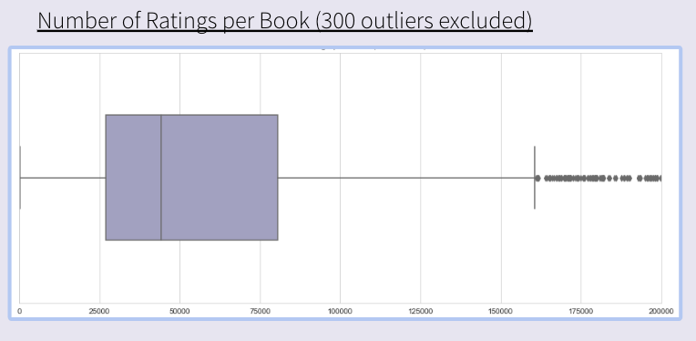
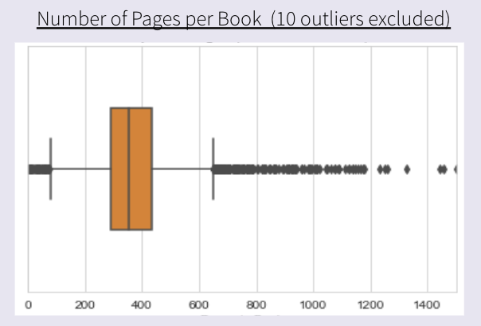
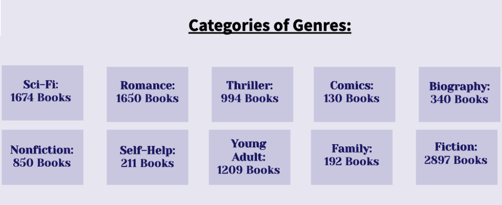
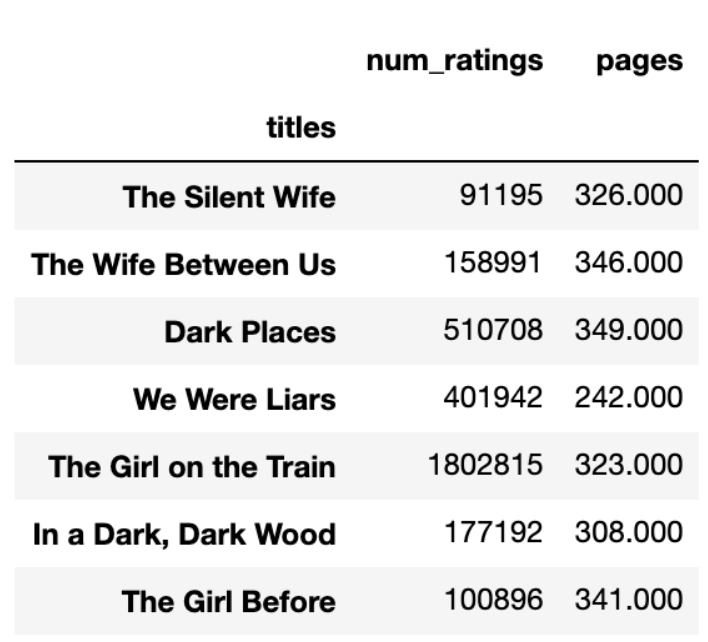

# Your Next Page Turner -  Book Recommender

### Project Objectives
- Introduce similar books to reader using Content-Based Recommendation System
- Add filters for better recommendations

### Dataset
- Top 200 from every year in the past 20 years with a total of 4100+ books.
- Essential information on every book including: title, authors, user rating, length, description and so on..

### Exploratory Data Analysis

Using this graph, I decided to group the dataset into 3 groups of popularity: 
- "Super Popular": number of ratings < 27000
- "Well Known": 27000 < number of ratings < 800000
- "Deep Cut": number of ratings > 80000

 

  

Similar for book length, I divided the data set into 2 groups:
- Short: pages < 350
- Long: pages > 350

 

Also, because there were a lot of sub-genres, I put them into 10 major group of genre. 
For example, "History", "Politics", and "Cooking" are considered "Non-Fiction". Or "Mystery", "Crime" and "Horror" are classified as "Thriller".

### Baseline Model - Simple Recommender
This is a simple model using the above features to generate book suggestions.

**Features:** Genre, Length, and Popularity

**Example**: Let's say you want a "Sci-Fi", "Long" and "Super Popular" book, the recommendations for you will be:
- Harry Porter and The Prisoner of Azkaban (Harry Porter, #3)
- Ender's Shadow (The Shadow Series, #1)
- Gardens of the Moond (Malazan Book of Fallen, #1)

### Description-Based Recommender
This model uses only the description of the book to give recommendations.

**Feature:** Description

**Process:** 
- Create Bag of Words for each book using the description of the book
- TF-IDF Vectorize the Bag of Words (BoWs)
- Compute Cosine Similarity between BoWs 
- Use Cosine Similarity to generate recommendations

**Example:** I want to read books that are similar with "Gone Girl". 
*A little about "Gone Girl": it's about a seemingly happy married couple. Then things begin to get complicated when the wife mysteriously disappears.

The recommendations are:
- Into the Water
- The Silent Wife
- The Hunger Games (The Hunger Games, #1)
- The Lying Game (The Lying Game, #1)
- Girls in Pants: The Third Summer of the Sisterhood (Sisterhood, #3)

Looking at these recommendations, I think this model does an ok job, because "Into the Water", and "The Silent Wife" are kind of similar with "Gone Girl". However, "The Hunger Games" is pretty different. I feel like this model is missing information. That leads me to create the next model.

### Full Complexity Model
Instead of just using description, I added author's name and gernes of the book

**Features:** Description, Author, Genre

**Process:** It's similar with how I created the previous one but with more information in the BoWs
- Create Bag of Words for each book using *authors, genres and description* of the book
- TF-IDF Vectorize the Bag of Words (BoWs)
- Compute Cosine Similarity between BoWs 
- Use Cosine Similarity to generate recommendations

**Example:** I use the same book "Gone Girl" to see the differences in the recommended books.

The recommendations are:
- The Silent Wife
- Into the Water
- The Mephisto Club (Rizzoli & Isles, #6)
- The Wife Between Us
- Dark Places

These suggestions seem much better. The top 2 are the same with the ones from Description-Based Recommender. All of them are  "Thriller". There are 2 titles with the word "Wife". And "Dark Place" are from the same author, Gillian Flynn, as "Gone Girl" 

### Final Model - Full Complexity Model with Filters
In order to give the best possible recommendations, I created the last model as a combination of the Full Complexity Model and the Baseline Model

**Features:** Author, Genre, Description, Length and Popularity

**Example:** Still similar with "Gone Girl", but only "Short" and "Super Popular" books

